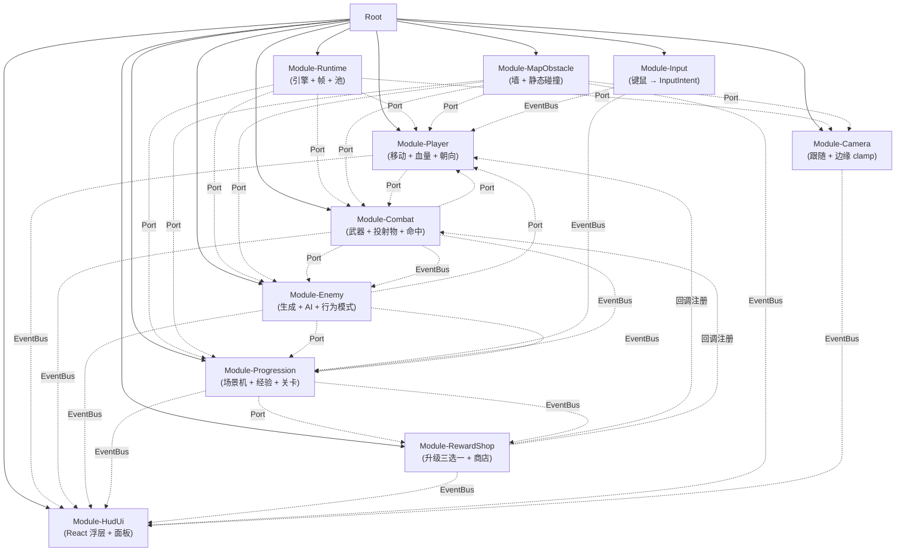

# 土豆兄弟风格游戏 —— 模块化开发路线(顶层)

> 本文档是**顶层**路线,只承载:
>
> 1. 整局游戏的核心设计(场景循环、状态机、通信契约)。
> 2. 第一层模块的**能力清单**(每个模块对外暴露什么、用它做什么)。
> 3. 模块之间的粘合层(EventBus / GameContext / Ports)与**代码目录结构**。
>
> **每个模块自身的实现细节、子模块拆分、独立验收点,都在 [`modules/`](./modules/) 下各自的文档里**。本路线不锁死模块内部怎么拆。
>
> 文档递归约定:子模块文档再做拆分时,**自己**创建一个子目录(如 `modules/player/sub/...`),在子目录里再做同样的"顶层 = 抽象能力 / 子文档 = 自身实现"拆分,**不**回写到上一层文档。

---

## 落地进度

| 模块                  | 状态      | 落地日期   | 验收                                 |
| --------------------- | --------- | ---------- | ------------------------------------ |
| **M1 Module-Runtime** | ✅ 第一版 | 2026-07-04 | vitest + tsc + vp check 全绿         |
| **M2 Module-Input**   | ✅ 第一版 | 2026-07-04 | vitest(84 用例)+ tsc + vp check 全绿 |
| **M3 Module-Player**  | ✅ 第一版 | 2026-07-04 | vitest(41 用例)+ tsc + vp check 全绿 |
| M4 Module-Combat      | ⬜ 未开始 | —          | —                                    |
| M5 Module-Enemy       | ⬜ 未开始 | —          | —                                    |
| M6 Module-Progression | ⬜ 未开始 | —          | —                                    |
| M7 Module-RewardShop  | ⬜ 未开始 | —          | —                                    |
| M8 Module-HudUi       | ⬜ 未开始 | —          | —                                    |
| M9 Module-MapObstacle | ⬜ 未开始 | —          | —                                    |
| M10 Module-Camera     | ⬜ 未开始 | —          | —                                    |

**粘合层进度:**

| 文件                               | 状态 | 说明                                                            |
| ---------------------------------- | ---- | --------------------------------------------------------------- |
| `src/runtime/types.ts`             | ✅   | `Vec2 / ActorId / ActorSpec / SceneSpec / HitResult / InputKey` |
| `src/runtime/ports/RuntimePort.ts` | ✅   | Runtime 完整 Port                                               |
| `src/runtime/ports/InputPort.ts`   | ✅   | Input 完整 Port                                                 |
| `src/runtime/EventBus.ts`          | ✅   | 强类型总线,首批事件 `input:*`                                   |
| `src/runtime/GameContext.ts`       | ⬜   | 暂无模块用,等首个消费者                                         |
| `src/runtime/RootContainer.ts`     | ⬜   | 等至少 2 个模块落地后做装配                                     |

---

## 0. 起点声明:从零开始,不复用旧实现

> 本路线是**全新基线**。仓库里现存的 `src/game/scene.ts` / `src/game/balance.ts` / `src/game/weapons/*` / `src/game/components/*` / `src/pages/Game.tsx` / `src/pages/Home.tsx` / `src/styles/app.css` / `src/assets/*` 全部视为**已废弃的脚手架**,**不**被新模块复用、不被新模块参考、也不被新模块"渐进式改造"——它们的存在只是为了让仓库在重写期间还能 `pnpm dev` 跑起来。
>
> 新模块从零按本路线实现,各自产出自己的实现、自己的常量、自己的测试、自己的资源占位。

---

## 0.x 设计原则(所有模块必须遵守)

### 0.1 解耦铁律

> **模块 A 不得 `import` 模块 B 的任何符号。**
> **模块 A 不得直接 `new` 模块 B 提供的 Actor / 组件。**

模块之间**只**通过三种方式通信:

1. **EventBus(事件)**:发 / 订阅命名事件。事件 payload 是**纯数据**(`{ x, y, hp, kind, ... }`),**绝不**放 Actor 引用。
2. **Context(共享只读状态)**:从 `GameContext` 读取其他模块暴露的"权威快照"。`GameContext` 由"根容器"组装,模块只读、绝不写。
3. **Port(显式调用接口)**:模块通过**注入的 Port 接口**调用其他模块的能力(例如 Player 模块注入 `CombatPort`,Player 调 `combatPort.tryFire()`)。Port 是**接口**(`.ts` 里的 `interface`),实现类在根容器里注册,模块**只持有接口引用**,不持有实现类,不知道也不关心实现方。

### 0.2 权威原则

> 每个数据字段**只有**一个模块是权威写入方。

| 数据                                   | 权威模块    |
| -------------------------------------- | ----------- |
| 玩家位置 / 朝向 / 血量                 | Player      |
| 投射物生成 / 命中判定                  | Combat      |
| 敌人 AI / 行为 / 击杀                  | Enemy       |
| 经验值 / 升级 / 关卡阶段               | Progression |
| 升级 / 商店奖励发放                    | RewardShop  |
| 地图障碍 / 静态碰撞                    | MapObstacle |
| 输入意图                               | Input       |
| HUD 显示(纯渲染)                       | HudUi       |
| 引擎实例 / Actor 池 / 帧驱动           | Runtime     |
| 摄像机世界坐标 / 视口大小 / clamp 范围 | Camera      |

HUD 显示的是其他模块的快照副本,任何"看似 HUD 改了数值"的代码都是 bug。

### 0.3 独立验收原则

> **每个模块必须有"独立可测试"的形式,根容器只是把模块拼起来。**

验收形态按模块类型二选一:

- **逻辑型模块**(Player / Combat / Enemy / Progression / RewardShop / MapObstacle):
  必带 vitest 单测。单测**不**依赖 Excalibur `Engine` 真跑(通过 `RuntimePort` 的 Mock 工厂 stub 掉 spawn / tick / 池)。
- **桥接型模块**(Runtime / Input / HudUi):
  逻辑少、贴引擎/UI,以集成测试为主,提供**模块级 Mock 工厂**(供其他模块单测时 stub 用)。
- **集成层**:`src/test/integration/` 下的用例把多个模块拼起来跑端到端,验证模块间契约。
- **不再保留"模块级 Demo 页"路由**。每个模块的能力通过**单测** + **集成测试**演示,不单开 `/demo/<module>` 页面——Demo 路由在本项目里被砍掉,避免维护两套入口。

### 0.4 范围边界

按确认的范围:**完全复刻土豆兄弟核心循环,不做成就 / 每日挑战 / 解锁 / i18n / 触屏 / 联机 / 账号**。后续改造(自定义角色 / 武器 / 敌人)在此之上叠加。

---

## 1. 核心设计:游戏场景状态机

整局游戏有**一个** `GameScene` 状态机,由 `Progression` 模块独占持有。其他模块**不**直接知道这个概念,只通过订阅 `level:phase` 事件被动响应。

```ts
type GameScene =
  | "character_select" // 起始:选角色(角色系统启用后可跳;首版可跳到 running)
  | "running" // 关卡战斗中:Player/Combat/Enemy 全部 active,时钟走
  | "levelup_modal" // 战斗中升级三选一:Combat 暂停,RewardShop 弹 3 个选项,时钟停
  | "portal" // 倒计时到点:出传送门,玩家还能清场,时钟停
  | "shop" // 进传送门后:商店面板,时钟停
  | "gameover" // 死亡:时钟停,引擎 clock 冻结,场景不再更新
  | "victory"; // 通关(最终关后):时钟停
```

**状态转移表**:

| 当前 scene         | 触发                        | 下一个 scene    | 副作用                                             |
| ------------------ | --------------------------- | --------------- | -------------------------------------------------- |
| `character_select` | 玩家选完角色并点开始        | `running`       | spawn 玩家、加载关卡 1 地图                        |
| `running`          | `xp >= xpToNext`            | `levelup_modal` | 暂停时钟,Progression 拿 3 个 RewardId 放进 context |
| `levelup_modal`    | 玩家点选(`reward:picked`)   | `running`       | 调 `applyReward`,恢复时钟                          |
| `running`          | 倒计时 = 0                  | `portal`        | spawn PortalActor,暂停时钟                         |
| `portal`           | 玩家进 Portal               | `shop`          | 加载商店,清本关敌人/投射物                         |
| `shop`             | 玩家离开商店 / 关闭         | `running`       | 加载下一关地图(关卡 + 1),恢复时钟                  |
| 任意               | 收到 `player:died`          | `gameover`      | 引擎 clock.stop,等重开                             |
| `running`          | 当前是最终关且打掉最终 Boss | `victory`       | 引擎 clock.stop                                    |

**场景切换的物理实现 = 三件事**(只有 Progression 调):

1. `GameEventBus.emit({ type: "level:phase", scene, context })` —— 通知 HUD 和所有订阅者
2. `runtime.engine.clock.start() / stop()` —— 暂停 / 恢复物理世界(玩家、敌人、投射物冻住,UI 不冻)
3. 调 `MapObstacle.loadLevel(n)` / 清场等 —— 物理资源换页

---

## 2. 粘合层(根容器负责,模块不感知)

> 这一层**不**算模块,是模块之间通信的"协议层",由 `game/src/runtime/` 提供,**所有模块都依赖**。它是唯一允许跨模块"共享"的地方。
> 字段 / 接口**形状**在本节列出,但具体类型定义与实现位置见 `game/src/runtime/` 下的源码(本路线不锁死文件签名,只锁"语义")。

### 2.1 `GameEventBus`(事件总线)

所有跨模块通知走这里。事件 payload 必须是**纯数据**(`{ x, y, hp, kind, ... }`),**绝不**放 Actor 引用。

事件清单(命名 `xxx:action` 风格):

- 输入:`input:move` / `input:fire` / `input:pause`
- 玩家:`player:moved` / `player:damaged` / `player:died`
- 战斗:`projectile:hit` / `enemy:killed`
- 敌人:`enemy:spawned` / `enemy:dying`
- 进度:`xp:gained` / `level:up` / `level:phase` / `timer:tick` / `portal:appeared`
- 奖励:`reward:available` / `reward:applied` / `reward:picked`
- 地图:`map:loaded`
- 摄像机:`camera:moved`

API 形状:`on(type, handler) → unsubscribe`、`emit(event)`、`clear()`(重开时调用)。

### 2.2 `GameContext`(共享只读快照)

各模块把**自己**的权威字段通过 getter / 函数暴露到 `GameContext` 上,其他模块**只读**。字段全是**函数/getter**,每次调用取最新值(模块用"发布者更新内部状态"模式,Context 是窗口不是副本)。任何**写**操作一律走 EventBus / Port,谁直接改 Context 谁就是 bug。

暴露的快照类别(详见各模块文档):

- `player`:`pos / hp / maxHp / facing`
- `weapons`:`current`
- `enemies`:`list`(`readonly { kind, pos, hp }[]`)
- `map`:`bounds / isBlocked`
- `camera`:`pos / viewportSize`

### 2.3 `Ports`(显式调用接口,根容器注入)

模块只 export Port 接口和它**自己**的实现。**模块的 Port 接口里,不出现其他模块的类型名**(用 ID 字符串或共享 enum)。

调用样例:Player 模块持有 `CombatPort` 引用,自己决定何时调 `combatPort.tryFire()`,Combat 不知道也不关心调用方是 Player。详细接口见各模块文档的"对外 Port"小节。

### 2.4 `RootContainer` 装配

`RootContainer` 是**唯一** import 全部模块的地方。模块构造函数统一签名:`new XxxModule(deps: ModuleDeps)`,`deps = { bus, ctx, ports }`。

装配顺序无依赖(因为模块之间不互相 import),但 `runtime.start()` 必须在所有 `onAttach()` 之后。装配本身不感知场景循环,场景循环由 Progression 模块驱动。

---

## 3. 第一层模块(能力清单)

> 顶层的模块章节**只**回答两个问题:
>
> 1. 这个模块**对外提供什么能力**(Port)?
> 2. 这个模块**自己利用别人的能力做什么事**(消费哪些 Port / 订阅哪些事件)?
>
> 内部子模块怎么拆、Port 字段类型、具体验收步骤 → 各自子文档。

### 3.1 [Module-Runtime](./modules/runtime.md)

- **能力**:封装 Excalibur `Engine` 生命周期、帧驱动 tick、Actor 工厂、对象池、坐标系统、碰撞层。
- **利用它做什么**:本模块是**最底层**,**所有**其他模块 spawn Actor / 订阅 tick / 用对象池都要找它。
- **它不做什么**:任何游戏对象(玩家 / 敌人 / 投射物)的业务逻辑。

### 3.2 [Module-Input](./modules/input.md)

- **能力**:把键盘 / 鼠标归一化为 `InputIntent` 事件和实时查询(按键状态、移动轴、瞄准轴)。
- **利用它做什么**:Player 模块订阅 `input:move` / `input:fire`,Progression 订阅 `input:pause`。
- **它不做什么**:不消费事件,只产生。

### 3.3 [Module-Player](./modules/player.md)

- **能力**:玩家 Actor 的生命周期、移动、血量、朝向、受击反馈。
- **利用它做什么**:Combat 调用 `PlayerPort.pos()` 算弹道起点,Enemy 调用 `PlayerPort.applyDamage()` 做接触伤害,HUD 订阅 `player:damaged / player:died` 渲染血条与 Game Over 面板。
- **它利用别人的能力**:Runtime(spawn 自己) / MapObstacle(碰撞查询) / Combat(开火)。
- **它不做什么**:武器、攻击判定、敌人 AI、关卡逻辑。

### 3.4 [Module-Combat](./modules/combat.md)

- **能力**:武器数据 + 投射物生成 + 命中判定 + 击杀事件分发。
- **利用它做什么**:Player 调 `CombatPort.tryFire()` 触发攻击,HUD 订阅 `projectile:hit` / `enemy:killed` 渲染命中/击杀反馈,Progression 订阅 `enemy:killed` 累加经验。
- **它利用别人的能力**:Runtime(spawn 投射物) / MapObstacle(投射物撞墙) / Enemy(读列表选目标 + 写伤害) / Camera(`isOnScreen()` 屏幕外子弹裁剪,可选优化)。
- **它不做什么**:敌人行为、玩家移动、经验值。

### 3.5 [Module-Enemy](./modules/enemy.md)

- **能力**:敌人数据 + AI 行为 + 状态机 + 生成调度 + 接触伤害。
- **利用它做什么**:Combat 调 `EnemyPort.list()` 选目标 / 调 `EnemyPort.applyDamage()` 写伤害,Progression 调 `EnemyPort.spawn()` / `clear()` 控密度,HUD 订阅 `enemy:spawned / enemy:dying` 渲染小地图与击杀数。
- **它利用别人的能力**:Runtime(spawn 敌人) / Player(接触伤害) / Progression(拿关卡配置) / Camera(`isOnScreen()` 视口外 AI 跳过,可选优化)。
- **它不做什么**:投射物、武器、关卡。

### 3.6 [Module-Progression](./modules/progression.md)

- **能力**:**整局游戏的"导演"**。维护 `GameScene` 状态机、经验、升级、关卡倒计时、传送门生成、商店编排、升级三选一编排。
- **利用它做什么**:**全游戏只有它**知道"现在处于哪个 scene / 倒计时剩多少 / 当前关配置",其他模块**全部**通过订阅 `level:phase` 事件被动响应。HUD 渲染全部根布局靠这个事件。
- **它利用别人的能力**:Runtime(控 clock / spawn Portal) / MapObstacle(切关) / RewardShop(roll 升级/商店选项)。
- **它不做什么**:玩家血量、武器伤害、UI 渲染、敌人 AI。

### 3.7 [Module-RewardShop](./modules/rewards.md)

- **能力**:升级三选一选项生成、商店物品列表、`applyReward` 按注册回调表分发奖励。
- **利用它做什么**:Progression 调 `RewardShopPort.rollLevelUpChoices() / rollShopItems() / applyReward()` 编排升级与商店流程,HUD 订阅 `reward:available` 渲染卡片。
- **它利用别人的能力**:**不**持有其他模块的 Port(避免反向 import)。改其他模块权威字段的入口是 RootContainer 装配阶段的**注册回调**(`{ id, kind, apply(deps) }`),谁注册谁执行。
- **它不做什么**:UI 卡片渲染、关卡计时。

### 3.8 [Module-HudUi](./modules/hud.md)

- **能力**:React 浮层,根据订阅到的 `level:phase` 自动切换根布局,渲染 HP 条 / 经验条 / 计时 / 武器图标 / 升级 / 商店 / Game Over / Victory。
- **利用它做什么**:玩家在 UI 上点了升级卡 → HUD 发出 `reward:picked` 事件,Progression 收到后切回 `running` scene。
- **它利用别人的能力**:**唯一**完全无 Port 依赖的模块,只订阅事件。**不知道 Progression 的存在**,只根据 `level:phase.scene` 决定渲染哪个根组件。
- **它不做什么**:游戏世界、玩家控制、武器逻辑。

### 3.9 [Module-MapObstacle](./modules/obstacle.md)

- **能力**:静态地图数据(墙 / 地面 / 出生点 / 传送门生成点)、碰撞查询、关卡切换。
- **利用它做什么**:Player 调 `isBlocked()` 做移动碰撞,Combat 调 `isBlocked()` 做投射物撞墙,Enemy 调 `isBlocked()` 做 AI 寻路,Progression 调 `loadLevel()` 切关。
- **它利用别人的能力**:无(纯静态数据)。
- **它不做什么**:敌人 spawn、关卡倒计时。

### 3.10 [Module-Camera](./modules/camera.md)

- **能力**:维护摄像机世界坐标(玩家跟随 + 地图边缘 hard clamp,无 smoothing / 无过渡动画)、视口大小、当前 clamp 范围;每帧把摄像机位置写入 Excalibur `Scene.camera`。**完全复刻土豆兄弟原版手感**——玩家走到地图边缘时摄像机停在边缘,玩家相对摄像机位置偏移;玩家没到边缘时摄像机永远把玩家钉在屏幕正中。对外暴露 `CameraPort.pos()` / `viewportSize()` / **`isOnScreen(worldPos)`**,其中 `isOnScreen` 复用同一份 clamp 几何(避免 Combat / Enemy 各自再算"可见区域")。
- **利用它做什么**:HudUi 订阅 `camera:moved` 做小地图 / 屏幕边缘提示;Combat / Enemy 在做屏幕外裁剪时调 `CameraPort.isOnScreen(pos)`(子弹飞出一屏就不算命中、敌人在视口外就不跑 AI,可选优化,首版不强制)。**不**走 `RuntimePort.viewportSize()` —— 屏幕外裁剪属于"摄像机语义",集中在本模块。
- **它利用别人的能力**:Runtime(`viewportSize()` 拿视口大小,写入 `Scene.camera.pos`)、Player(`PlayerPort.pos()` 读玩家位置作为跟随目标)、MapObstacle(`MapObstaclePort.bounds()` 读地图边界做 clamp;订阅 `map:loaded` 在切关时重算 clamp 范围)。
- **它不做什么**:玩家移动、地图加载、敌人 AI、UI 渲染、任何形式的摄像机缓动 / 过渡动画。

---

## 4. 模块依赖图(顶层视角)



**实线 = Port 依赖(由根容器注入),虚线 = 事件/数据流,虚线 "回调注册" = RootContainer 装配阶段给 RewardShop 注册的回调**。模块之间的 Port 依赖在根容器里注入,模块自身不知道被谁调用。

---

## 5. 代码目录结构(本路线定稿)

> 这是**唯一**生效的代码目录约定。所有新模块按此落位;旧脚手架(`src/game/` / `src/pages/Game.tsx` / `src/styles/app.css` / `src/assets/`)保留到对应模块替换它的那一刻再删,不再迁移内容。

```
game/
├── plan/                              ← 本路线文档
│   ├── modular-roadmap.md             ← 顶层:核心设计 + 模块能力清单 + 代码目录(本文档)
│   └── modules/                       ← 第一层模块子文档
│       ├── runtime.md
│       ├── input.md
│       ├── player.md
│       ├── combat.md
│       ├── enemy.md
│       ├── progression.md
│       ├── rewards.md
│       ├── hud.md
│       ├── obstacle.md
│       └── camera.md
├── src/
│   ├── runtime/                       ← 粘合层(所有模块共享,模块之间不互相 import)
│   │   ├── EventBus.ts
│   │   ├── GameContext.ts
│   │   ├── ports/                     ← 每模块一个 Port 接口文件
│   │   │   ├── RuntimePort.ts
│   │   │   ├── InputPort.ts
│   │   │   ├── PlayerPort.ts
│   │   │   ├── CombatPort.ts
│   │   │   ├── EnemyPort.ts
│   │   │   ├── ProgressionPort.ts
│   │   │   ├── RewardShopPort.ts
│   │   │   ├── HudPort.ts
│   │   │   ├── MapObstaclePort.ts
│   │   │   └── CameraPort.ts
│   │   ├── RootContainer.ts
│   │   └── types.ts
│   ├── modules/                       ← 第一层模块,每个一个目录
│   │   ├── runtime/
│   │   ├── input/
│   │   ├── player/
│   │   ├── combat/
│   │   ├── enemy/
│   │   ├── progression/
│   │   ├── rewards/
│   │   ├── hud/
│   │   ├── obstacle/
│   │   ├── camera/
│   │   └── _shared/
│   ├── test/                          ← 测试代码,见 §5.1
│   │   ├── setup.ts                   ← vitest 全局 setup(已存在,继续用)
│   │   ├── unit/                      ← 跨模块的纯函数 / 工具测试
│   │   └── integration/               ← 集成测试:把多个模块拼起来跑端到端
│   ├── pages/                         ← React 路由层(薄壳,只挂 RootContainer 启动)
│   │   └── Game.tsx
│   ├── main.tsx                       ← React 入口
│   ├── App.tsx                        ← 路由表
│   └── styles/
│       └── app.css
└── (旧脚手架 src/game/* 在对应模块落地后删除)
```

### 5.1 测试代码布局(本路线定稿)

> 砍掉了原先的 "模块级 Demo 页路由"(`pages/demos/<module>/...`)。模块能力的展示/验收一律走 vitest。

- **模块单测**:`src/modules/<name>/**/*.test.ts`
  紧贴实现,被测模块以 `*.test.ts` 后缀与生产代码并列(`vite.config.ts` 的 `test.include: ["src/**/*.test.ts"]` 已覆盖)。
  例:`src/modules/combat/WeaponRegistry.test.ts` 与 `src/modules/combat/WeaponRegistry.ts` 同目录。
- **跨模块 / 工具测试**:`src/test/unit/**/*.test.ts`
  例如 `EventBus` / `GameContext` / 共享纯函数。
- **集成测试**:`src/test/integration/**/*.test.ts`
  把多个模块拼起来,验证模块间契约(事件、Port、Context 联动)。**不**起 Excalibur 真实 `Engine`——通过 `RuntimePort` 的 Mock 工厂把 `tick / spawn / pool` 全部 stub 掉。
- **共享 Mock 工厂**:`src/modules/<name>/__mocks__/`(或 `src/test/mocks/`)
  桥接型模块(Runtime / Input / HudUi)与逻辑型模块的 Port,都提供工厂函数,供其他模块的单测与集成测试 stub。

### 5.2 关键约束(执行铁律)

- `modules/<name>/` 下**严禁**出现 `import` 别的 `modules/<other>/` 路径。CI 钩子 `vp check` 会 grep 检查,违反即 fail。
- `runtime/ports/*.ts` 是**类型**的归宿,模块**实现**在 `modules/<name>/`,`ports` 文件可以**引用** `modules/<name>/index.ts` 里的 class 当实现类型,但反过来不行。
- **不**在仓库里创建 `src/pages/demos/` 路径;不添加 `/demo/*` 路由。模块能力以测试验收,不再以 Demo 页面验收。
- 测试代码**只**允许出现在以下位置:
  - `src/modules/<name>/**/*.test.ts`(模块单测)
  - `src/test/unit/**`(跨模块纯函数)
  - `src/test/integration/**`(集成)
  - `src/test/setup.ts`(vitest 全局 setup,已存在)
    其他位置出现 `*.test.ts` 即视为破坏约束。
- 旧 `src/game/**` / `src/pages/Home.tsx` / `src/styles/app.css` / `src/assets/*` / `src/pages/Game.tsx` 不被新代码 import,留着只是为了在重写期间 `pnpm dev` 还能起。等各模块的第一版落地后,按"删一补一"策略逐文件清掉。
- 不预设任何具体武器 / 敌人实现,只定义 `WeaponRegistry` / `EnemyRegistry` 接口。第一版只有 1 把 Pistol + 1 种 Chaser,**完全复刻土豆兄弟**。后续改造在此之上叠。
