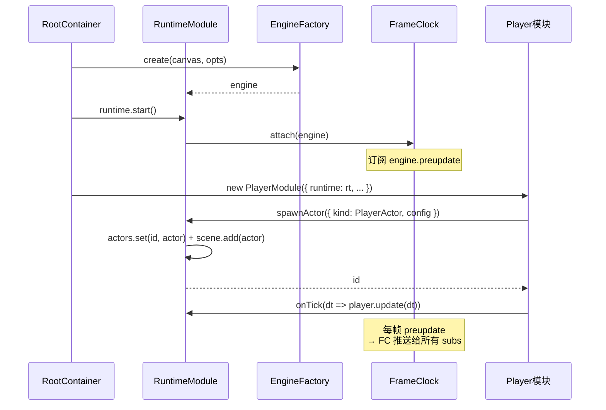

# Module-Runtime

> 顶层路线见 [`../modular-roadmap.md`](../modular-roadmap.md)。本文件是 Runtime 模块的**自留地**:Port / 事件 / 内部子模块拆分 / 验收点都在这里。Runtime 是最底层,被所有其他模块依赖。

---

## 0. 一句话理解 Runtime

Runtime = **引擎胶水层**。它的全部存在意义,是把 Excalibur 这套相对底层、命令式的游戏引擎 API,**包成一个最小、最干净、最容易"假装不在"的接口**,然后塞给其他 8 个模块用。

你可以把它想成一个翻译官:

- 上游(Excalibur):`new Engine(...)`、`scene.add(actor)`、碰撞 group、对象池要自己维护……
- 下游(其他模块):只想 `spawnActor(spec)` / `onTick(cb)` / `pool('bullet', factory, reset)` / `raycast(...)`。

Runtime 把前者压扁成后者,自己吞掉所有"造引擎、开窗口、处理 resize、维护池、换算 dt"的脏活。

> **教学要点**:Runtime **不**懂任何游戏逻辑。它不知道玩家是谁、敌人是谁、关卡是什么;它只知道"有一坨 Actor 住在引擎里,每帧有人在画它们,我想办法让一切跑得顺"。

---

## 1. 职责

封装 Excalibur:`Engine` 生命周期、帧驱动 tick、Actor 工厂、对象池、坐标系统、碰撞层。**不**做游戏逻辑。

把它展开成"具体要做哪些事":

1. **造引擎并活下去**:`new Engine({...})`,挂到 DOM 上,处理窗口 resize / devicePixelRatio,游戏结束清理。
2. **管帧**:`preupdate` 事件 → 算出 dt → 回调给所有订阅者;提供一个"统一时钟 `now()`"。
3. **管 Actor 出生与死亡**:暴露 `spawnActor(spec)` / `despawnActor(id)` 让别人不用直接接触 Excalibur 的 `scene.add/remove`。
4. **管场景换页**:`loadScene<T>(sceneSpec): T`,让别人拿到场景根句柄。
5. **管对象复用**:`objectPool<T>(key, factory, reset)`,把"造 N 个子弹、回收 N 个子弹"这件事内化。
6. **管碰撞**:`addLayer(a, b)` 注册哪两组会撞,`raycast(...)` 提供空间查询。
7. **什么都不管**:玩家血量、敌人 AI、武器伤害、关卡状态——统统不管。

---

## 2. 对外 Port(别的模块看到的接口)

文件:`game/src/runtime/ports/RuntimePort.ts`

```ts
interface RuntimePort {
  engine: Engine; // 暴露引擎实例给"需要直接拿"的极少数调用方
  now(): number; // 毫秒,统一时钟
  spawnActor(spec: ActorSpec): ActorId; // 统一工厂
  despawnActor(id: ActorId): void;
  loadScene<T>(scene: SceneSpec<T>): T; // 拿到场景根句柄
  onTick(cb: (dt: number) => void): () => void; // 帧驱动订阅
  objectPool<T>(
    key: string,
    factory: () => T,
    reset: (t: T) => void,
  ): { acquire(): T; release(t: T): void };
  collision: {
    addLayer(a: string, b: string): void;
    raycast(from: Vec2, dir: Vec2, maxDist: number, layers: string[]): HitResult | null;
  };
}
```

`ActorSpec` / `SceneSpec` / `ActorId` 等类型在 `runtime/types.ts` 集中定义。

### 2.1 逐个方法教学

下面把每个方法当成"我第一次见这个 API"来讲。

#### `engine: Engine`

直接露出 Excalibur 引擎实例。**别的方法都用得到它内部的东西**,但没必要每个都包装;少数情况(比如 Progression 想 `engine.clock.start()/stop()`,或者某模块要直接 `engine.canvas`)就拿这个口子。

> 教学上叫"逃生舱口"(escape hatch):99% 的时候不要碰,只有"Port 真的没覆盖到"的边角才用。

#### `now(): number`

统一返回毫秒数。**不要让别的模块用 `Date.now()` 或 `performance.now()`**,因为暂停/恢复时它们都还在走,但 `Runtime.now()` 可以决定"按真实墙钟走还是按游戏内时钟走"(具体怎么实现,看 §5 `FrameClock` 子模块)。

**使用场景**:

- Combat 算"距离上次开火过了多少 ms" → `const elapsed = runtime.now() - lastFireAt;`
- Progression 算倒计时。

#### `spawnActor(spec: ActorSpec): ActorId`

**为什么不让别人自己 `new Actor`?** 因为 Actor 必须被加进 `engine.currentScene`,否则引擎根本不画它、也不参与物理。Runtime 帮你做了:

1. `const actor = new spec.kind(spec.config);` — 用 spec 里的"类"造实例;
2. `engine.currentScene.add(actor);` — 加进当前场景;
3. `id = actor.id; actors.set(id, actor);` — 自己内部存一份表,好让 `despawnActor(id)` 能找到它;
4. `return id;` — 把 id 给回去,调用方只持有 id,绝不直接持 Actor 引用(权威原则要求)。

**使用场景**:

- Player 模块开打时:`runtime.spawnActor({ kind: PlayerActor, config: { pos: {...}, hp: 100 } });`
- Combat 生成子弹:`runtime.spawnActor({ kind: BulletActor, config: { pos, vel, damage } });`
- Enemy 模块生成小怪。
- Progression 倒计时到了,生成 Portal。

#### `despawnActor(id: ActorId): void`

`spawn` 的反向操作:

1. `const actor = actors.get(id);`
2. `actor?.kill();` — Excalibur 里 `kill()` 会把 Actor 标记为待销毁,引擎下一帧真正移除。
3. `actors.delete(id);`

**使用场景**:玩家死亡、敌人被击杀、子弹出屏幕、关卡切换清场。

#### `loadScene<T>(scene: SceneSpec<T>): T`

换页。这是个**幂等且原子**的操作:把当前场景卸掉,按 `scene.spec` 装新的。`T` 是"场景根句柄"的类型——一个对象,场景里的模块可以用它读写场景级数据。

**为什么需要它?**

- Excalibur 的 `Scene` 有自己的生命周期(actor 列表、摄像机、灯光)。
- 关卡 1 → 关卡 2 必须**先清干净旧场景**(`engine.removeScene`),**再建新场景**,否则旧 actor 还在跑。

**使用场景**:Progression 决定切到下一关时调一次。

> 教学点:`loadScene` 返回的 `T`,是"场景级共享状态"的根句柄。比如关卡内的常量(关卡时长、敌人配额)挂在它上面,MapObstacle / Progression / Enemy 共读。

#### `onTick(cb: (dt: number) => void): () => void`

**这是 Runtime 唯一的"广播频道"。** 每帧 Excalibur 在更新前会发 `preupdate` 事件,Runtime 订阅它,把事件里带的 `delta`(毫秒)传给所有 `onTick` 订阅者。

返回的函数是**反订阅**——调它就从回调表里摘掉。**为什么强调反订阅?** 因为模块在 `onAttach` 注册,如果不反订阅,模块被卸掉后回调还在,会泄漏。

**使用场景**:

- Progression 在 `running` 场景里:`onTick(dt) => { this.timer -= dt; if (this.timer <= 0) this.enterPortal(); }`
- Enemy AI:`onTick(dt) => { this.chase(dt); }`
- HUD 不在这里订阅(它不依赖 Excalibur 时钟,自己靠 React)。

**为什么不直接发个 `tick:frame` 事件走 EventBus?** 因为事件系统是"异步、广播、纯数据"的,而帧回调是"必须每帧按顺序执行、可以写状态的"。两者语义不同。Runtime 把这个选择压在自己内部,不让别的模块看到 Excalibur 事件。

#### `objectPool<T>(key, factory, reset)`

泛型对象池。**签名里那个 `key: string` 是干什么的?**

答:同一个 `key` 在整个游戏里只允许存在一个池。第二次传相同 key,Runtime 直接返回已有的池(防止模块各自 new 自己的池,最后撞车)。

**生命周期三步**:

1. **取**(`acquire()`):池里还有存货就 pop 一个返回;没存货就 `factory()` 现造一个。
2. **用**:`const bullet = pool.acquire(); bullet.fire(...); ...` — 调用方拿出去用。
3. **还**(`release(t)`):Runtime **强制调一次** `reset(t)`,把对象重置成"刚出厂"状态,再 push 回池子。

> 教学重点:`reset` **必须**清状态。比如子弹要清位置、速度、已击中目标、剩余穿透次数、粒子尾迹。**如果 reset 写错**,下次 `acquire` 拿到的就是"带上一发子弹速度的子弹",游戏会崩在莫名其妙的地方。

**使用场景**:

- Combat 给子弹建池:`const bulletPool = runtime.objectPool('bullet', () => new BulletActor(), b => b.reset());`
- Enemy 给粒子 / 尸体建池。
- 任何"高频 new / 频繁回收"的对象。

#### `collision.addLayer(a, b)`

向 Excalibur 注册两个层 "会撞"。这是 Excalibur 的 collision group 机制——所有 Actor 在 spawn 时被分配 layer,只有 `addLayer` 注册过的两组才会真的做碰撞检测。

**为什么不默认全员互撞?** 性能。玩家撞墙要测、玩家撞敌要测、敌人撞墙要测、敌人互撞**不**用测(省 N² 级别的工作量)。

**使用场景**:

- 初始化阶段:`addLayer('player', 'enemy')`、`addLayer('bullet', 'enemy')`、`addLayer('bullet', 'wall')`。
- **不**需要 `addLayer('enemy', 'enemy')`,因为同种敌人互不挡路。

#### `collision.raycast(from, dir, maxDist, layers)`

从 `from` 沿 `dir` 射一条长度 `maxDist` 的射线,**只**碰指定 `layers`,返回最近的 `HitResult { actor, position, normal, distance } | null`。

**为什么需要 raycast,而 Excalibur 自带的 collision event 不够?**

- `actor.on('collisionstart', ...)` 只能"被撞了"才知道,不能"主动探测前面有没有墙"。
- AI 想"前方 200 px 是不是墙,要不要拐弯"——只能 raycast。
- 武器想"子弹打出去,飞到撞到东西"——Excalibur 自带能做,但 raycast 是更通用的查询。

**使用场景**:

- Enemy AI:`const hit = runtime.collision.raycast(enemy.pos, facing, 150, ['wall']); if (hit) steer(hit.normal);`
- Combat 算命中距离上限。

---

## 3. 事件

- **输入事件**:无(最底层)。
- **输出事件**:无(它只提供 tick 钩子,让 Progression 自己 `onTick` 推时间)。

> **教学点**:Runtime 是唯一一个"既不发也不订"的模块。它是基础设施,基础设施不发业务事件——就像 HTTP 库不主动给你发"有请求来了"事件,得你自己去监听。

---

## 4. 权威字段

`Engine` 实例、Actor 句柄表、对象池表、碰撞层表。

谁拥有谁写:

| 字段                                | 谁写                               |
| ----------------------------------- | ---------------------------------- |
| `engine` 实例                       | Runtime 自己(`new`)                |
| Actor 句柄表(`Map<ActorId, Actor>`) | Runtime 自己(`spawn/despawn` 时改) |
| 对象池表(`Map<string, Pool>`)       | Runtime 自己(`objectPool()` 时改)  |
| 碰撞层表                            | Runtime 自己(`addLayer` 时改)      |

其他模块**绝对不能**直接写这些字段——你写了我没法保证不破坏内部不变量(比如你直接 `engine.currentScene.add(actor)`,但没在句柄表登记,后续 `despawnActor(id)` 就找不到)。

---

## 5. 内部子模块草案

按职能拆 4 个内部子模块,**都**在本模块目录 `modules/runtime/` 下,**不**外露:

```
modules/runtime/
├── EngineFactory.ts         // 造 / 销毁 Engine
├── ObjectPool.ts            // 泛型对象池
├── FrameClock.ts            // onTick / now 的实现
├── CollisionLayerManager.ts // addLayer / raycast 的实现
└── RuntimeModule.ts         // 对外,组合上面四个
```

> 教学点:这 4 个子模块**只**给 `RuntimeModule` 自己用,别的模块 import 不到它们(因为别的模块不能 import Runtime 的内部)。这和"Runtime 只能 import Excalibur,不能 import 其他模块"是同一个解耦铁律的两面。

下面逐个讲。

### 5.1 `EngineFactory`

**职能**:创建 / 销毁 Excalibur `Engine`;处理 resize、像素比。

#### 关键方法

- `create(canvas: HTMLCanvasElement, opts): Engine`
  1. `const engine = new Engine({ canvas, width, height, antialiasing: true });`
  2. 设 `engine.setAntialiasing` / `engine.backgroundColor` 等视觉相关。
  3. 监听 `window.addEventListener('resize', () => engine.screen.resolution = ...);`
  4. 监听 `devicePixelRatio` 变化(Retina 屏来回拖窗口时会变)。
  5. 返回 `engine`。

- `destroy(engine)`:把第 3、4 步注册的监听都摘掉,然后 `engine.stop(); engine.dispose();`。

#### 它在什么场景工作

- RootContainer 装配阶段调一次 `create`,把引擎给 RuntimeModule。
- RootContainer 销毁阶段(理论上游戏关不掉,但调试 / 重启流程需要)调 `destroy`。

### 5.2 `ObjectPool`

**职能**:泛型对象池,提供 `{ acquire, release }`,reset 回调保证复用对象状态干净。

#### 关键方法

```ts
class ObjectPool<T> {
  private free: T[] = [];
  private inUse: Set<T> = new Set();
  constructor(
    private factory: () => T,
    private reset: (t: T) => void,
  ) {}
  acquire(): T {
    const t = this.free.pop() ?? this.factory();
    this.inUse.add(t);
    return t;
  }
  release(t: T): void {
    if (!this.inUse.delete(t)) return; // 防止重复 release
    this.reset(t); // 强制重置
    this.free.push(t);
  }
  // 调试用:验证"所有 acquired 都被 release 了"
  get inUseCount(): number {
    return this.inUse.size;
  }
}
```

#### 它在什么场景工作

- 子弹池、敌人尸体池、粒子池、伤害数字池——任何高频 spawn / despawn 的对象都走这里。
- Combat 模块启动时:`const bulletPool = new ObjectPool<BulletActor>(() => new BulletActor(), b => b.reset());` 然后通过 `runtime.objectPool('bullet', ...)` 拿到的就是这个东西。

#### 验收要点

`ObjectPool` 在 `acquire/release` 1000 次后,**`inUseCount` 必须严格等于 0**——这是验收点之一(见 §6)。任何"acquire 出去忘了 release"的 bug 都会被这个测试抓到。

### 5.3 `FrameClock`

**职能**:对外 `onTick(cb)` 与 `now()`,内部订阅 `engine.on('preupdate', ...)` 并换算 dt。

#### 关键方法

```ts
class FrameClock {
  private subs = new Set<(dt: number) => void>();
  private startWallTime = 0;
  private accumulated = 0;

  attach(engine: Engine): void {
    engine.on("preupdate", (e) => {
      const dtMs = e.delta; // Excalibur 给的 dt,毫秒
      this.accumulated += dtMs;
      for (const cb of this.subs) cb(dtMs);
    });
  }

  now(): number {
    // 返回"游戏内累计时间",不是 wall clock
    // 这样 clock.stop() 后调用方拿到的 now 不会跳
    return this.accumulated;
  }

  onTick(cb: (dt: number) => void): () => void {
    this.subs.add(cb);
    return () => this.subs.delete(cb);
  }
}
```

#### 它在什么场景工作

- 每帧:Excalibur 触发 `preupdate` → FrameClock 把 dt 广播给所有 `subs`。
- `now()` 在任意时刻被调,返回"游戏内时间"——暂停时它不动,这是它跟 `Date.now()` 的根本区别。

#### 为什么是 `preupdate` 而不是 `postupdate`?

`preupdate` 在所有 Actor 自己 update **之前**触发——这意味着 Runtime 的 onTick 回调会先于 Player/Enemy/Combat 的内部 update 执行。对游戏逻辑来说,顺序是:

```
preupdate (Runtime → FrameClock 广播)
  ↓
Actor.update (Player、Enemy、Combat 各自的 Excalibur 行为)
  ↓
物理 + 渲染
  ↓
postupdate
```

这样 Progression 在 `onTick` 里推时间 → 别的模块在自己的 `update` 里读"现在时间"就一致了。

### 5.4 `CollisionLayerManager`

**职能**:`addLayer(a, b)` 注册 Excalibur collision groups,`raycast` 封装空间查询。

#### 关键方法

- `addLayer(a, b)`
  Excalibur 的 API 形如 `CollisionGroupManager.instance.groups[a].collidesWith(groups[b])` 或者通过 `actor.body.collisionType = groupA`。具体落地形式取决于 Excalibur 版本(请到 `Refs/Excalibur/` 查证)。总之:**把"字符串 a 和字符串 b 应该碰撞"这个语义记录下来**,并在 spawn Actor 时把 layer 名映射到 collision group。

- `raycast(from, dir, maxDist, layers)`
  Excalibur 没有原生的射线查询 API,**Runtime 必须自己实现**。常见做法:
  1. 用 Excalibur 的 `Physics.rayCast`(`refs/Excalibur` 文档查证);
  2. 或者手动遍历 `engine.currentScene.actors`,过滤出在指定 layer 且在射线方向 + 距离内的;
  3. 返回距离最近的那个命中点。
  4. 包成 `{ actor, position, normal, distance }` 的统一结构,挡住 Excalibur 自己的细节。

#### 它在什么场景工作

- 初始化阶段:MapObstacle 把墙的 layer("wall")告诉 Runtime,Combat 把子弹的 layer("bullet")告诉 Runtime,然后 `addLayer('bullet', 'wall')`。
- 战斗中:Enemy AI 每帧 raycast 探测前方。

> **本模块如再拆更深,自建 `modules/runtime/sub/<name>.md` 子目录。**

---

## 6. 独立验收点

### 6.1 Demo 页(本项目已取消)

> 顶层路线 §0.3 已经决定砍掉 `/demo/<module>` 路由,改用 vitest 单测 + 集成测试。**这一节保留作为"原本要验收什么"的备查**,不再开路由。

原计划:**Demo 页** `/demo/runtime`:创建 Engine,画 1 个 Actor 让它以 100px/s 速度走 2 秒,断言位置 = (200, 0) ± 2。

### 6.2 vitest 单测

- **`ObjectPool`**:`acquire/release` 1000 次后无内存泄漏(`inUseCount` 归零)。
- **`raycast`**:在已知布局下命中正确点(给定墙坐标,断言 `hit.position`)。

### 6.3 集成测试

- 把 Runtime + Input + Player + MapObstacle 拼起来,验证"按 D 键 2 秒后玩家 Actor 位置 = (200, 0) ± 2",这是 §0.3 提到的 `src/test/integration/` 范畴。

---

## 7. 不做清单

- 不做游戏对象(玩家 / 敌人 / 投射物)的逻辑,只提供"创建 / 销毁 / 池化 / 帧"。
- 不发任何业务事件(它产出的唯一"事件"是 tick 回调)。
- 不感知 `GameScene` 状态机(状态机归 Progression 拥有,Runtime 只听 Progression 调 `engine.clock.start/stop`)。

> **教学点(三大禁令)**:这三条是 Runtime 边界的核心。**任何模块**要往 Runtime 里塞"如果是 running scene 就怎样"或者"如果是 player 就怎样",都该被拒绝——因为那是在让基础设施去理解业务。**这会把 Runtime 从"翻译官"变成"翻译官 + 半个游戏导演"**,失去通用性,后面加任何新模块都会在 Runtime 这里撞墙。

---

## 8. 一图流:RicPlayer 进入引擎的全程



---

## 9. 与其他模块的关系(只看 Runtime 视角)

| 模块        | 给 Runtime 提的输入                                                                 | 从 Runtime 拿的能力                        |
| ----------- | ----------------------------------------------------------------------------------- | ------------------------------------------ |
| Input       | 无                                                                                  | 无(独立)                                   |
| Player      | `spawnActor(PlayerActor)`、`onTick`、`pool('playerBody')`                           | tick 推进                                  |
| Combat      | `spawnActor(BulletActor)`、`pool('bullet')`、`raycast`、`addLayer('bullet','wall')` | tick 推进                                  |
| Enemy       | `spawnActor(EnemyActor)`、`raycast`、`addLayer('enemy','wall')`                     | tick 推进                                  |
| Progression | `loadScene(...)`、`engine.clock.start/stop`、`onTick` 推倒计时                      | 全套                                       |
| RewardShop  | 无                                                                                  | 无                                         |
| HudUi       | 无                                                                                  | 无                                         |
| MapObstacle | `addLayer('wall','...')`                                                            | `spawnActor` 静态墙(可选,通常墙也是 Actor) |

Runtime **永远是被叫的那个**,从来不主动叫别人。这叫"依赖倒置的最底层"——所有上层模块都往 Runtime 伸手,Runtime 只往上伸手给 Excalibur。
